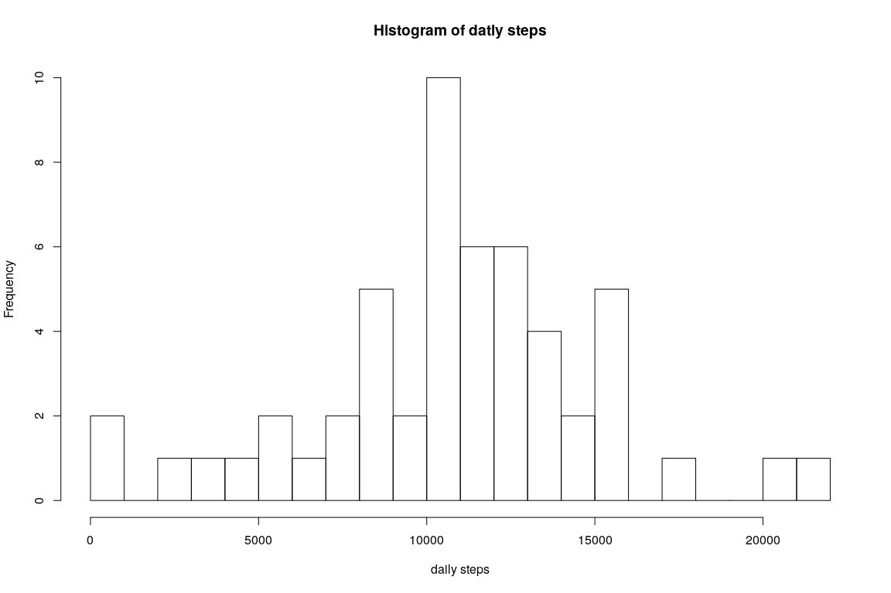
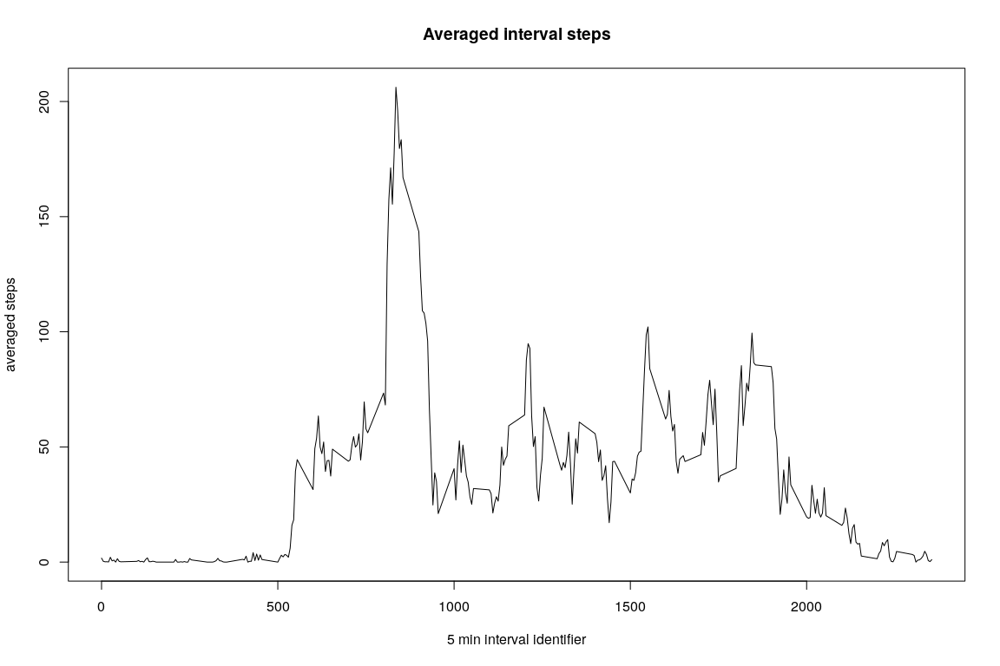
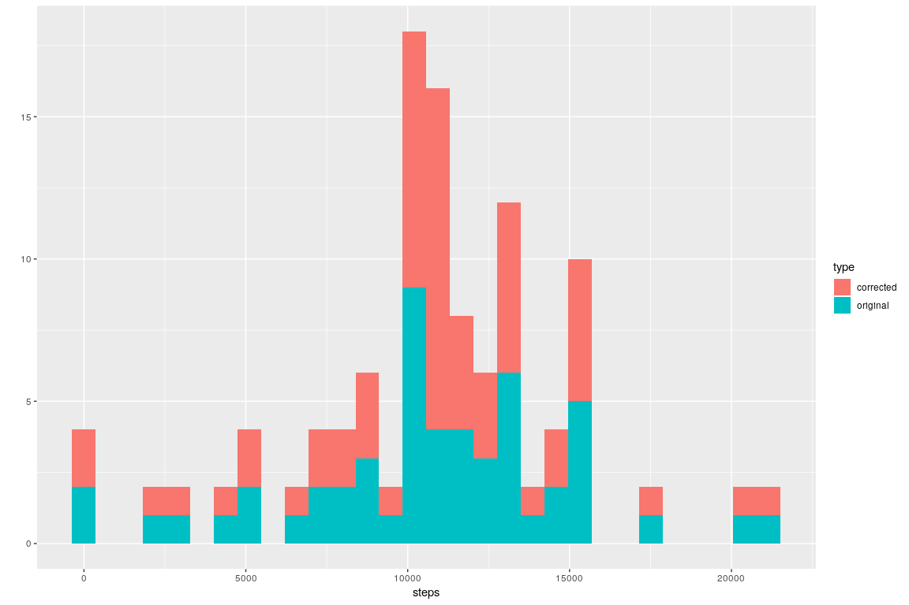
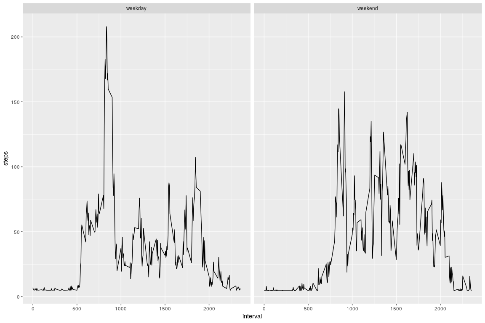

## Loading and preprocessing the data

In this assignment I am working with the activity data base which I have forked from: https://github.com/rdpeng/RepData_PeerAssessment1
In the code below I unzip the data and load it into R.


```r
library(lubridate)
library(dplyr)
library(tidyr)
library(ggplot2)

unzip("activity.zip")
data <- read.csv("activity.csv")
```

## What is mean total number of steps taken per day?

First of all I transform my data in extract the total amount of daily steps


```r
# convert into class data
data[,2] <- ymd(data[,2])
dailyssteps <- filter(data,!is.na(steps)) %>% group_by(date) %>% summarise(sum(steps))
```

Here I make a histogram of the total number of steps taken each day. I also calculate the mean and the median of the distribution.

```r
hist(dailyssteps$`sum(steps)`, breaks = 20, main = "Histogram of datly steps", xlab = "daily steps")
```

<!-- -->

```r
dmean <- mean(dailyssteps$`sum(steps)`)
dmedian <- median(dailyssteps$`sum(steps)`)
```

So we see that the mean of the distribution is 1.0766189\times 10^{4} and the median of the distribution is 10765.  

## What is the average daily activity pattern?

First I calculate the number of steps taken for each 5-minute interval averaged across all days.

```r
intervalsteps <- filter(data,!is.na(steps)) %>% group_by(interval) %>% summarise(mean(steps))
```

Below I plot the relevant time series and calculate, order the intervals steps and calculate the maximum amount of average steps and its corresponding interval.

```r
plot(intervalsteps$interval, intervalsteps$`mean(steps)`, type = "l", main = "Averaged interval steps", xlab = "5 min interval identifier", ylab = "averaged steps")
```

<!-- -->

```r
orderedintervalsteps <- intervalsteps[order(intervalsteps$`mean(steps)`, decreasing = TRUE),]
maxinterval <- orderedintervalsteps[[1,1]]
maxstep <- orderedintervalsteps[[1,2]]
```
I see that the maximal amount of average daily steps is 206.1698113 and it occours on in the 835th 5-min interval identifier. This identifier correspond to the time 8:35 AM, and I assume this is the time when people go to work and are hence most active.

## Imputing missing values

There are a number of days/intervals where there are missing values. The presence of missing days may introduce bias into some calculations or summaries of the data.


```r
totNA <- sum(is.na(data$steps))
```


The total amount of NAs in the data set is 2304, which is about 13% and is not negligible. I fill the missing values in the original data set by substituting them with the mean. I however kepp both the original and corrected data sets and add an additional variable "type" used for sepparating between them.


```r
names(data) <- c("original","date", "interval")
data$corrected <- data$original
data$corrected[is.na(data$corrected)] = mean(data$corrected, na.rm = TRUE)
data <- gather(data, type, steps, c(original, corrected))
dailyssteps <- group_by(data, date, type) %>% summarise(sum(steps))
names(dailyssteps) <- c("date", "type", "steps")
```


A comparison between the original and the corrected distributions can be seen in the histogram below.


```r
qplot(steps, data = filter(dailyssteps,!is.na(steps)), fill=type)
```

```
## `stat_bin()` using `bins = 30`. Pick better value with `binwidth`.
```

<!-- -->

```r
dmeannew <- mean(subset(dailyssteps, type=="corrected")$steps)
dmediannew <- median(subset(dailyssteps, type=="corrected")$steps)
```

The corrected distribution looks quite similar to the original with the exception that it has more counts towards the middle of the distribution. Note that the way the histogram appears is that the counts from the originaldistribution and the corrected one are sacked up!. The new mean and median are 1.0766189\times 10^{4} and 1.0766189\times 10^{4}, respectively, which is 0% and  0.0110421% higher than from the original values, which is not a lot.

## Are there differences in activity patterns between weekdays and weekends?

First I create a new factor variable in the dataset with two levels -- "weekday" and "weekend" indicating whether a given date is a weekday or weekend day.


```r
# set localtime so the days of the week come out in english
Sys.setlocale("LC_TIME", "C")
```

```
## [1] "C"
```

```r
data <- mutate(data, DayType = "weekday")
data$DayType[grepl("Saturday|Sunday", weekdays(data$date))] <- "weekend"
data$DayType <- as.factor(data$DayType)
table(data$DayType)
```

```
## 
## weekday weekend 
##   25920    9216
```

Wee see that we have about 3 times more data from weekdays than from weekends. Now I make a panel plot containing a time series plot of the 5-minute interval and the average number of steps taken, averaged across all weekday days or weekend days. 


```r
intervalsteps <- group_by(subset(data, type == "corrected"), interval, DayType) %>% summarise(steps=mean(steps))
qplot(interval, steps, data = intervalsteps, facets = .~ DayType,  geom = "path")
```

<!-- -->

So this confirms that people like to stay in bed longer when there on weekends. So they typicaly start to move later in the day, and are more active in between wekdays working hours 
